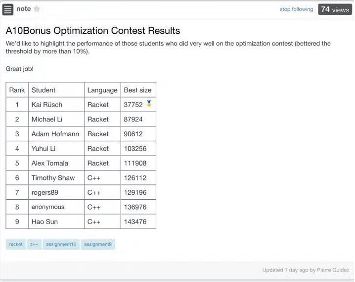

# Compiler for WLP4 language

- WLP4 is a simplified version of C. 
- WLP4 “WooL P Four” = “Waterloo, Language, Plus, Pointers, Plus, Procedures”
- [WLP4 Programming Language Tutorial](https://www.student.cs.uwaterloo.ca/~cs241/wlp4/WLP4tutorial.html)
- [WLP4 Programming Language Specification](https://www.student.cs.uwaterloo.ca/~cs241/wlp4/WLP4.html)
- If you are interested in the source code of this project, please send a request email and specify your purpose to haosun187#gmail.com (change # to @)

